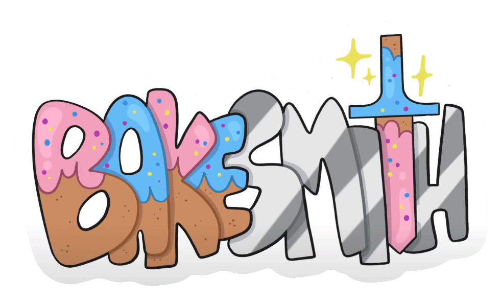
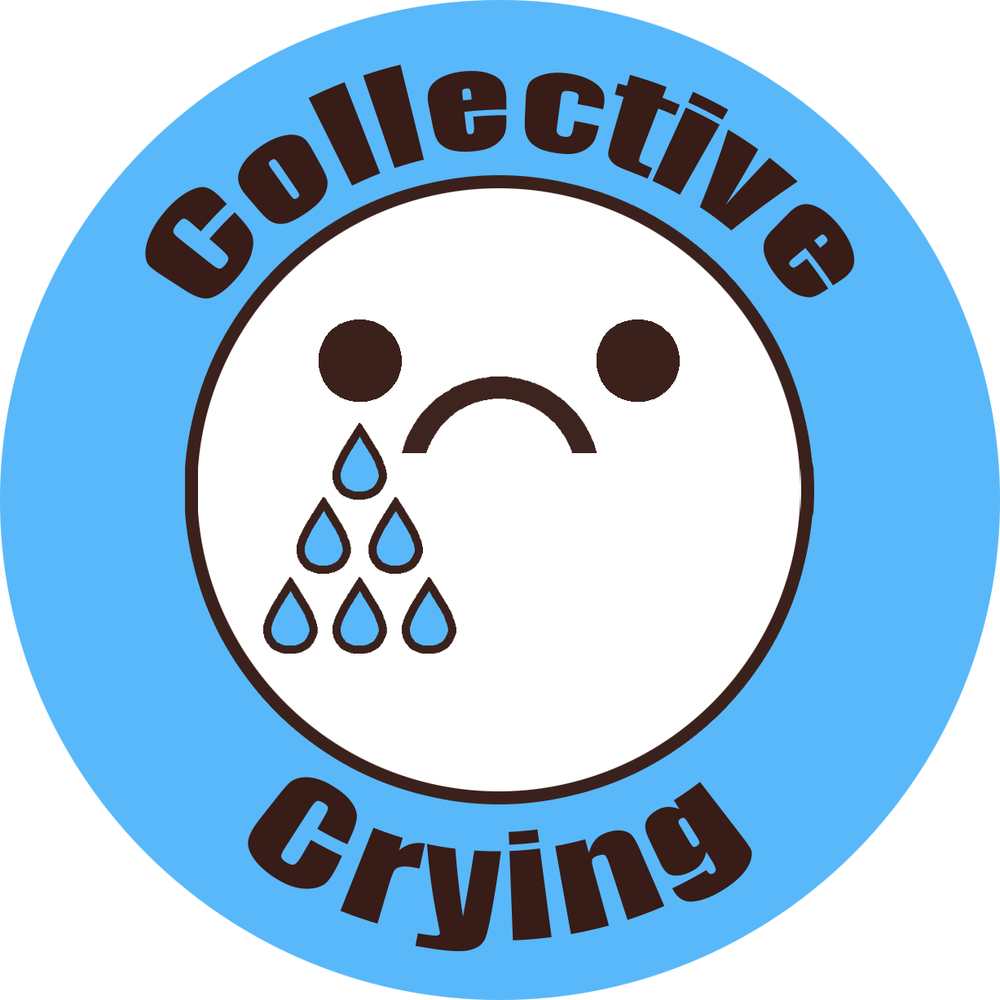

# WPU Senior Collaboration Project 2022

  

From William Peace University's Game Design Bachelor progam, SGD 411 is described as "A capstone experience in the 
Simulation and Game Design sequence. In teams, students will work across and outside of typical production roles 
in order to design, prototype, and create a digital game."

Our project brought to you by **Collective Crying**: _Bakesmith_ consisted of making a game with a learning aspect, pre-production of an agreed idea,
a high-concept that fleshes out gameplay mechanics, story, concept art, and roles. This repository not only goes over those documents, but
also includes the visual assets and scripts made over the project. This project included working with the MOCAP System for all of our animations, using Maya,
Blender, Substance Painter, Procreate and Photoshop for all of our art and design assets and using Unity and Visual Studio Code for our main development.
The README file will include links to each document and videos that were created to showcase our process.

**To play our game, you can find it here on [Itch.io's _Bakesmith_](https://aaleaf.itch.io/bakesmith)**

_Group Members_
1. **Sean Ray**: Design Lead with a Secondary in Tech - Duties included weapon modeling, written dialogue, and the lore pages
2. **Quadir Miller**: Support Lead with a Secondary in Tech - Duties included Sound Implementation and Creation
3. **Aleece Harmon**: Art Lead and Secondary in Design - Duties included Character and Enemy Models, their rigging and animations, as well as all Sprites used
4. **Kaylah Derilus**: Art Lead and a Secondary in Support - Duties included Environment Models and Textures
5. **Micheal Mansfield**: Design Lead with a Secondary in Tech & Art - Duties included Level Creation, Enemy Wave and Drop System, AI Movement System and Animation Implementation + Song creation and Environment Visuals
6. **Christopher Tate**: Tech Lead with a Secondary in Support - Player Animations and Movement, Weapon Crafting and Animation Implementation and the UI System

**DOCUMENTS**

Throughout our work process, we documented based off of deadlines from the course which can be found here, including some of our main documents: 

1. [Pre-Production Document](https://docs.google.com/document/d/1Q1DmUMdx7_eXBjA_akXScQQQUC3REVDfMnVVb1N11bo/edit?usp=sharing) - Includes early concept art, assets, and schedule
2. [NPC Dialogue](https://docs.google.com/document/d/1Qrgvo6nI1F2rYCl9zFmqovEsK_xiduXy/edit?usp=sharing&ouid=112908703237745887955&rtpof=true&sd=true) - Main Dialogue used in-game
3. [Lore Document](https://docs.google.com/document/d/1jGZNh6cKJT6oTTXmDDyjBAE3fozM94chkydbCpb-eSQ/edit?usp=sharing) - Lore text used when unlocking each (6) lore page
4. [High Concept Document](https://docs.google.com/document/d/1oM-nFKDz51bjoCQi4ZjC97UStgDuKPEQC_wBbNPCjL0/edit?usp=sharing) - This includes our Visual Style, Player and Enemy Designs, our Learning Aspect, Story, Technical Requirements and our Schedule-to-follow 
5. [_Bakesmith_ Trailer and Gameplay](https://www.youtube.com/watch?v=qnohqXOBezs&ab_channel=acharmon_edu)

  

